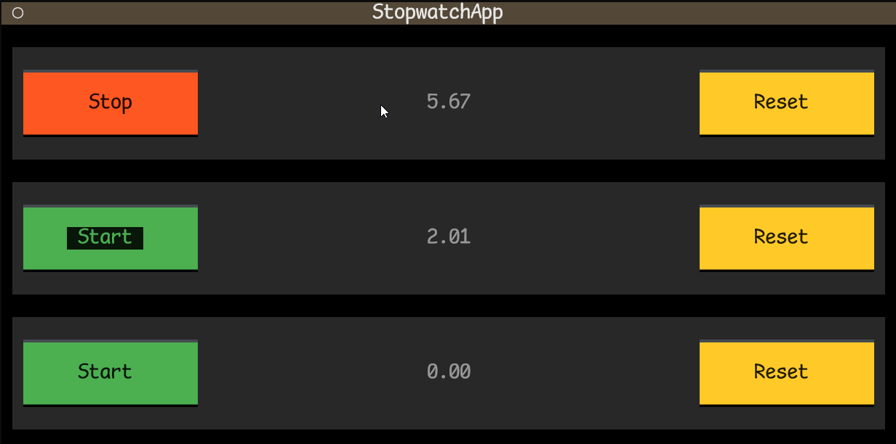

# Textual!

Textual is the hot new library for building text-based user interfaces (TUIs) in Python.
It is built on top of [Rich](https://rich.readthedocs.io/en/latest/),
[by the same developers](https://www.textualize.io/).

Mental model:
- A Textual "app" is a tree of "widgets".
- Widgets either contain other widgets or contain something to draw: a Rich renderable.
- Widgets react to "events", which can include things like pressing buttons.
- Widgets are "styled" (colors, positioning, etc.) via a CSS-like language.

This should remind you of HTML with JavaScript event handlers and CSS stylesheets!

We'll walk through the same example as the [official Textual tutorial](https://textual.textualize.io/tutorial/).
I've cut some things and done some other things in not-quite-the-recommended way though,
so if this looks cool, go through the official tutorial too!

Our goal is to get something that look like the image below
and behaves like a stopwatch with multiple independent timers.

